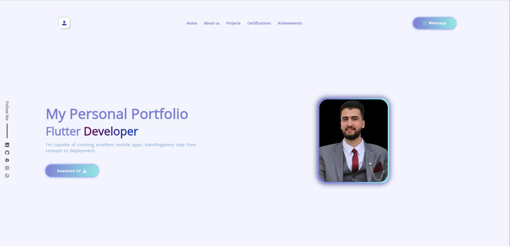
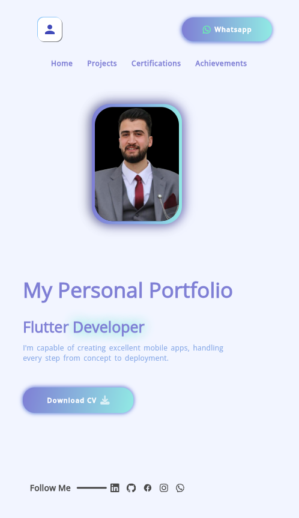
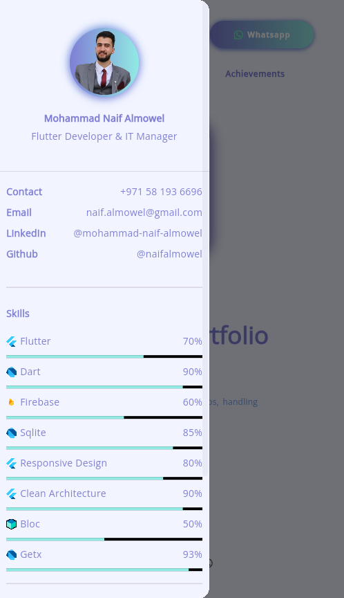

# 💼 My Personal Portfolio - Flutter Developer

This is my personal portfolio website built using **Flutter Web**, hosted on **Firebase Hosting**.

## 📍 Live Website

🌐 [naifalmowel.web.app](https://naifalmowel.web.app)

## 📸 Screenshots

### 🖥️ Desktop View


### 📱 Mobile View


### 🧑‍💼 About Sidebar


## 👨‍💻 About Me

**Name:** Mohammad Naif Almowel  
**Role:** Flutter Developer & IT Manager  
**Email:** naif.almowel@gmail.com  
**Phone:** +971 58 193 6696  
**LinkedIn:** [@mohammad-naif-almowel](https://linkedin.com/in/mohammad-naif-almowel)  
**GitHub:** [@naifalmowel](https://github.com/naifalmowel)

## 🧠 Skills

| Skill                 | Level |
|----------------------|-------|
| Flutter              | 70%   |
| Dart                 | 90%   |
| Firebase             | 60%   |
| SQLite               | 85%   |
| Responsive Design    | 80%   |
| Clean Architecture   | 90%   |
| BLoC                 | 50%   |
| GetX                 | 93%   |

## 📂 Project Structure

- `lib/` → Flutter UI and logic
- `build/web/` → Generated web files for deployment
- `firebase.json` → Firebase Hosting config

## 🚀 Deployment

This site is deployed using Firebase Hosting:

```bash
flutter build web
firebase deploy --only hosting:naifalmowel
